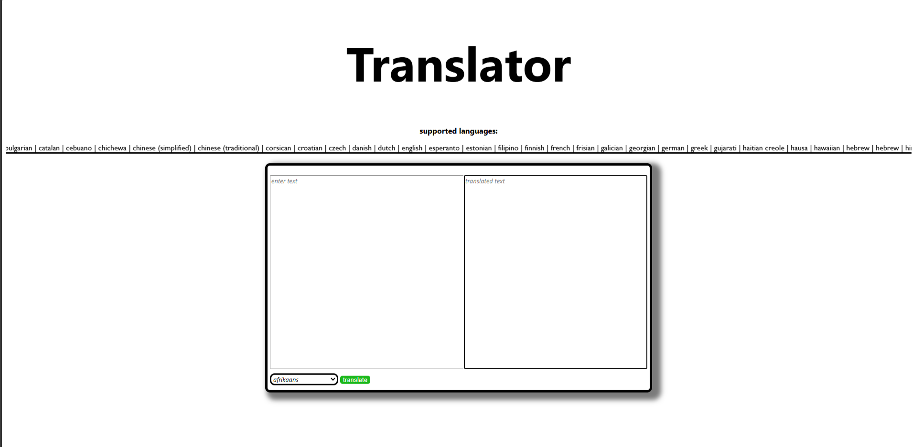

# Translator-website

A translator site built on django.

<h2>To create a project:</h2>

<h3>create venv:</h3>

##
    python -m venv venv

<h3>activate venv:</h3>   
for Win cmd.exe:

##
    venv\Scripts\activate.bat

for Powershell:

##
    venv\Scripts\activate.ps1

<h3>install important libs:</h3>

## 
    pip install -r requirements.txt

<h3>run project:</h3>

##
    python manage.py runserver
